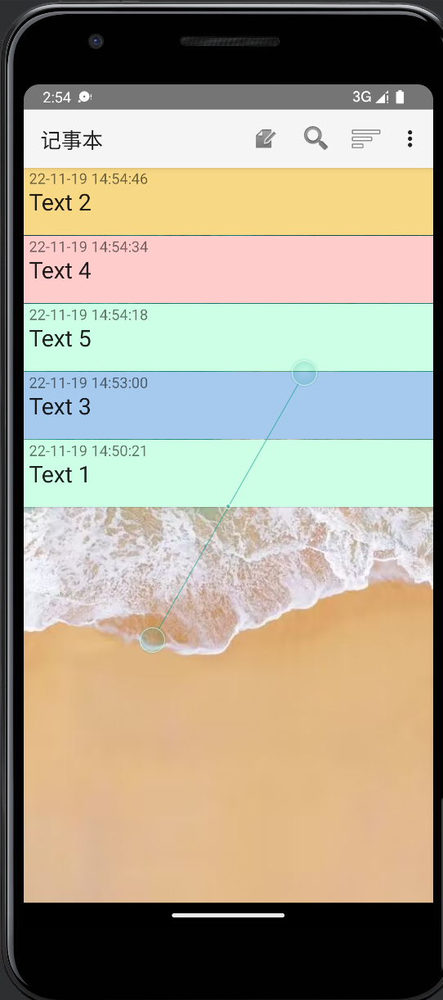
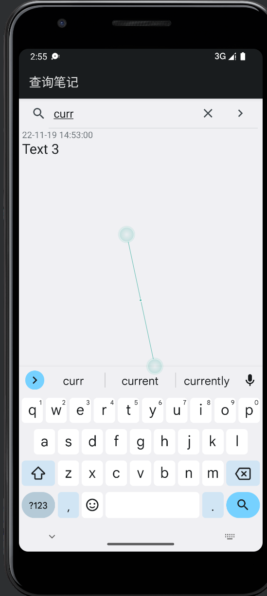
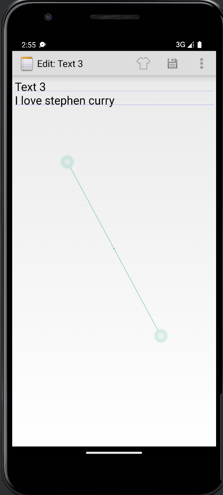
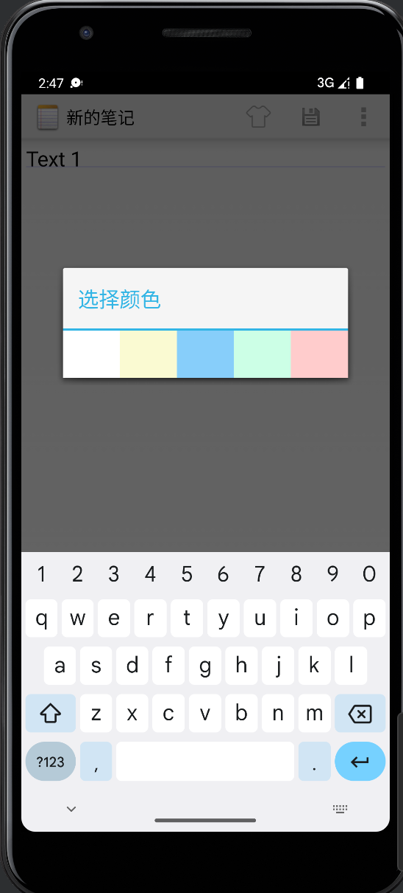
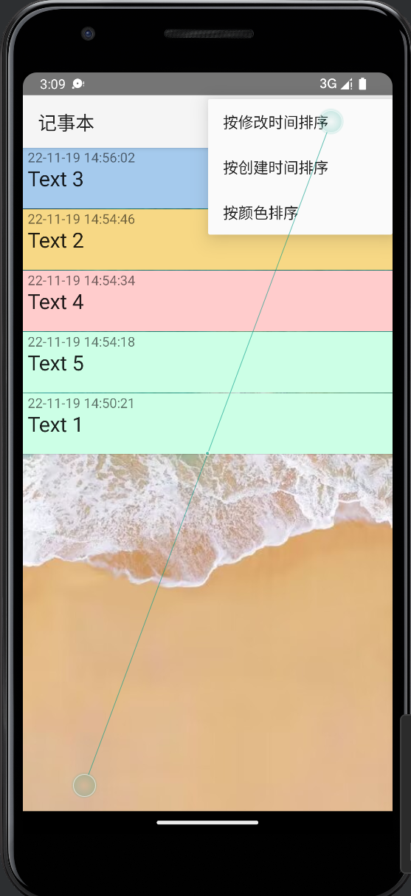
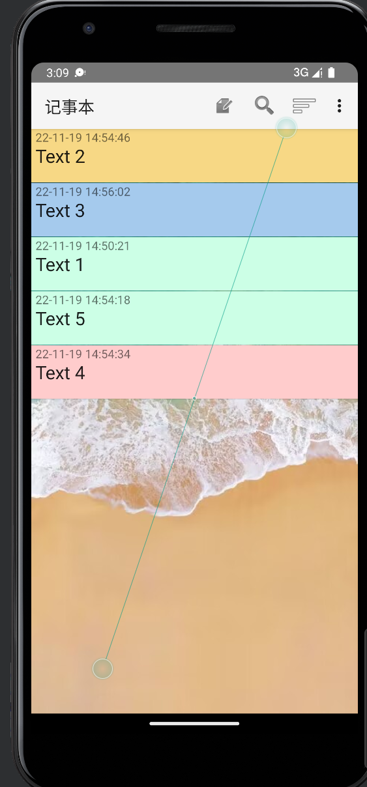
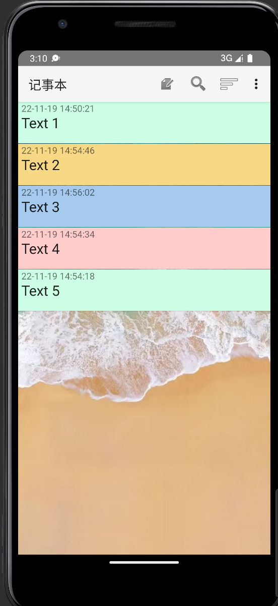
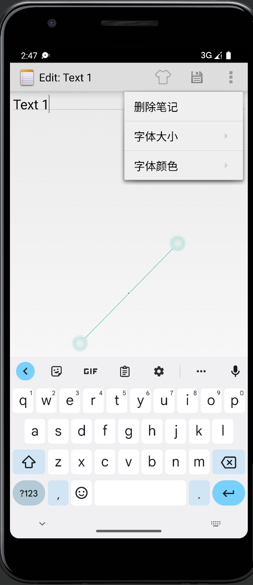
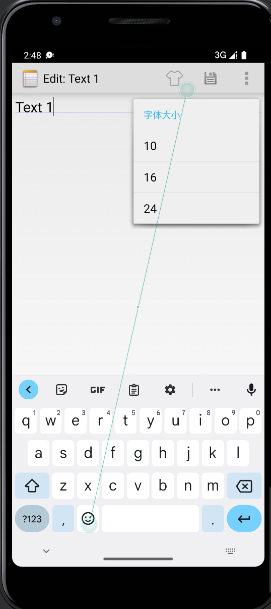
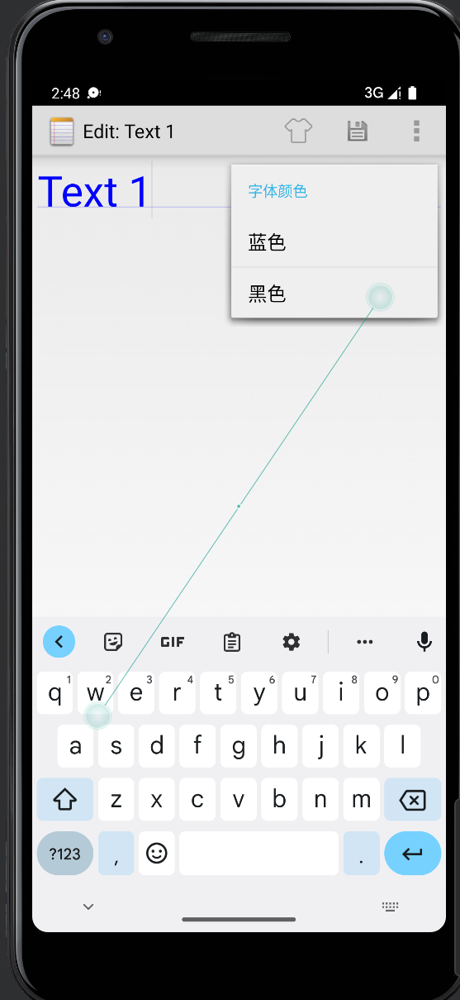

# Android开发期中实验

## 基本功能

### 1、增加时间戳

#### 思路

1、修改NoteList.java中的PROJECTION内容，增加一个COLUMN_NAME_MODIFICATION_DATE字段

```
private static final String[] PROJECTION = new String[] {
            NotePad.Notes._ID, // 0
            NotePad.Notes.COLUMN_NAME_TITLE, // 1
            //Extended:display time, color
            NotePad.Notes.COLUMN_NAME_MODIFICATION_DATE, // 2
            NotePad.Notes.COLUMN_NAME_BACK_COLOR
    };

```
2、同时在适配器中做相应的增加

```
final String[] dataColumns = { NotePad.Notes.COLUMN_NAME_TITLE , NotePad.Notes.COLUMN_NAME_MODIFICATION_DATE} ;
int[] viewIDs = { android.R.id.text1, R.id.text2};

```

3、在notelist_item.xml中增加相应时间戳的布局

4、修改NoteEditor.java中的关于时间格式的方法

```
private final void updateNote(String text, String title) {

        // Sets up a map to contain values to be updated in the provider.
        ContentValues values = new ContentValues();
        Long now = Long.valueOf(System.currentTimeMillis());
        SimpleDateFormat sf = new SimpleDateFormat("yy/MM/dd HH:mm");
        Date d = new Date(now);
        String format = sf.format(d);
        values.put(NotePad.Notes.COLUMN_NAME_MODIFICATION_DATE, format);

```

#### 实验结果



### 2、根据标题查询笔记

#### 思路

1、在NoteList.java中增加intent跳转到NoteSearch

```
        case R.id.menu_search:
        //Find function
        //startActivity(new Intent(Intent.ACTION_SEARCH, getIntent().getData()));
          Intent intent = new Intent(this, NoteSearch.class);
          this.startActivity(intent);
          return true;

```
2、NoteSearch.java

```
package com.example.android.notepad;
import android.app.Activity;
import android.content.Intent;
import android.database.Cursor;
import android.database.sqlite.SQLiteDatabase;
import android.os.Bundle;
import android.widget.ListView;
import android.widget.SearchView;
import android.widget.SimpleCursorAdapter;
import android.widget.Toast;

public class NoteSearch extends Activity implements SearchView.OnQueryTextListener
{
    ListView listView;
    SQLiteDatabase sqLiteDatabase;
    /**
     * The columns needed by the cursor adapter
     */
    private static final String[] PROJECTION = new String[]{
            NotePad.Notes._ID, // 0
            NotePad.Notes.COLUMN_NAME_TITLE, // 1
            NotePad.Notes.COLUMN_NAME_MODIFICATION_DATE//时间
    };

    public boolean onQueryTextSubmit(String query) {
        Toast.makeText(this, "you choose:"+query, Toast.LENGTH_SHORT).show();
        return false;
    }

    @Override
    protected void onCreate(Bundle savedInstanceState) {
        super.onCreate(savedInstanceState);
        setContentView(R.layout.note_search);
        SearchView searchView = findViewById(R.id.search_view);
        Intent intent = getIntent();
        if (intent.getData() == null) {
            intent.setData(NotePad.Notes.CONTENT_URI);
        }
        listView = findViewById(R.id.list_view);
        sqLiteDatabase = new NotePadProvider.DatabaseHelper(this).getReadableDatabase();
        //Set the searchview to display the search button
        searchView.setSubmitButtonEnabled(true);

        //Set the prompt text displayed by default in this searchview
        searchView.setQueryHint("search");
        searchView.setOnQueryTextListener(this);

    }
    public boolean onQueryTextChange(String string) {
        String selection1 = NotePad.Notes.COLUMN_NAME_TITLE+" like ? or "+NotePad.Notes.COLUMN_NAME_NOTE+" like ?";
        String[] selection2 = {"%"+string+"%","%"+string+"%"};
        Cursor cursor = sqLiteDatabase.query(
                NotePad.Notes.TABLE_NAME,
                PROJECTION, // The columns to return from the query
                selection1, // The columns for the where clause
                selection2, // The values for the where clause
                null,          // don't group the rows
                null,          // don't filter by row groups
                NotePad.Notes.DEFAULT_SORT_ORDER // The sort order
        );
        // The names of the cursor columns to display in the view, initialized to the title column
        String[] dataColumns = {
                NotePad.Notes.COLUMN_NAME_TITLE,
                NotePad.Notes.COLUMN_NAME_MODIFICATION_DATE
        } ;
        // The view IDs that will display the cursor columns, initialized to the TextView in
        // noteslist_item.xml
        int[] viewIDs = {
                android.R.id.text1,
                android.R.id.text2
        };
        // Creates the backing adapter for the ListView.
        SimpleCursorAdapter adapter
                = new SimpleCursorAdapter(
                this,                             // The Context for the ListView
                R.layout.noteslist_item,         // Points to the XML for a list item
                cursor,                           // The cursor to get items from
                dataColumns,
                viewIDs
        );
        // Sets the ListView's adapter to be the cursor adapter that was just created.
        listView.setAdapter(adapter);
        return true;
    }
}

```

3、增加一个note_search.xml布局文件和在list_option_menu.xml增加搜索按钮

4、在清单文件注册activity

```
        <activity android:name=".NoteSearch" android:label="@string/search_note" />

```

#### 实验结果




## 附加功能

### 1、UI美化

#### 思路

换了一个背景图片

```
        getWindow().setBackgroundDrawableResource(R.drawable.sea);

```

换了一个主题


```
       android:theme="@android:style/Theme.Material.Light"

```

#### 实验结果


### 2、更换笔记颜色

#### 思路

1、NotePad.java中添加字段

```
        public static final String COLUMN_NAME_BACK_COLOR = "color";
        public static final int DEFAULT_COLOR = 0; //white
        public static final int YELLOW_COLOR = 1; //yellow
        public static final int BLUE_COLOR = 2; //blue
        public static final int GREEN_COLOR = 3; //green
        public static final int RED_COLOR = 4; //red

```
2、在数据库中增加相应颜色字段

```
       public void onCreate(SQLiteDatabase db) {
           db.execSQL("CREATE TABLE " + NotePad.Notes.TABLE_NAME + "   ("
                   + NotePad.Notes._ID + " INTEGER PRIMARY KEY,"
                   + NotePad.Notes.COLUMN_NAME_TITLE + " TEXT,"
                   + NotePad.Notes.COLUMN_NAME_NOTE + " TEXT,"
                   + NotePad.Notes.COLUMN_NAME_CREATE_DATE + " INTEGER,"
                   + NotePad.Notes.COLUMN_NAME_MODIFICATION_DATE + " INTEGER,"
                   + NotePad.Notes.COLUMN_NAME_BACK_COLOR + " INTEGER" //color
                   + ");");
       }
```
3、在NotePadProvider.java中做数据库的相应处理

```
        sNotesProjectionMap.put(
                NotePad.Notes.COLUMN_NAME_BACK_COLOR,
                NotePad.Notes.COLUMN_NAME_BACK_COLOR);

      
        if (values.containsKey(NotePad.Notes.COLUMN_NAME_BACK_COLOR) == false) {
            values.put(NotePad.Notes.COLUMN_NAME_BACK_COLOR, NotePad.Notes.DEFAULT_COLOR);
        }
```
4、自定义一个MyCursorAdapter.java

```
package com.example.android.notepad;

import android.content.Context;
import android.database.Cursor;
import android.graphics.Color;
import android.view.View;
import android.widget.SimpleCursorAdapter;

public class MyCursorAdapter extends SimpleCursorAdapter {
    public MyCursorAdapter(Context context, int layout, Cursor c,
                           String[] from, int[] to) {
        super(context, layout, c, from, to);
    }
    @Override
    public void bindView(View view, Context context, Cursor cursor){
        super.bindView(view, context, cursor);
        //Get the color data corresponding to the note list from the cursor read from the database, and set the note color
        int x = cursor.getInt(cursor.getColumnIndex(NotePad.Notes.COLUMN_NAME_BACK_COLOR));
        /**
         * white 255 255 255
         * yellow 247 216 133
         * blue 165 202 237
         * green 161 214 174
         * red 244 149 133
         */
        switch (x){
            case NotePad.Notes.DEFAULT_COLOR:
                view.setBackgroundColor(Color.rgb(255, 255, 255));
                break;
            case NotePad.Notes.YELLOW_COLOR:
                view.setBackgroundColor(Color.rgb(247, 216, 133));
                break;
            case NotePad.Notes.BLUE_COLOR:
                view.setBackgroundColor(Color.rgb(165, 202, 237));
                break;
            case NotePad.Notes.GREEN_COLOR:
                view.setBackgroundColor(Color.rgb(161, 214, 174));
                break;
            case NotePad.Notes.RED_COLOR:
                view.setBackgroundColor(Color.rgb(244, 149, 133));
                break;
            default:
                view.setBackgroundColor(Color.rgb(255, 255, 255));
                break;
        }
    }
}
```
5、在NoteList.java中的PORJECTION里增加相应字段
！！！注意这里增加了相应字段的时候需要卸载app再重新运行，不能直接调试，否则一直找不到错误

6、将SimpleCursorAdapter改为使用MyCursorAdapter

```
//        // Creates the backing adapter for the ListView.
//        SimpleCursorAdapter adapter
//            = new SimpleCursorAdapter(
//                      this,                             // The Context for the ListView
//                      R.layout.noteslist_item,          // Points to the XML for a list item
//                      cursor,                           // The cursor to get items from
//                      dataColumns,
//                      viewIDs
//              );
        //Modify to a custom adapter that can be filled with color. The custom code is in MyCursorAdapter.java
        MyCursorAdapter adapter = new MyCursorAdapter(
                this,
                R.layout.noteslist_item,
                cursor,
                dataColumns,
                viewIDs
        );
```
7、在NoteEditor.java中的onOptionsItemSelected方法，在菜单的switch中添加

```
        case R.id.menu_color:
            changeColor();
            break;

    private final void changeColor() {
        Intent intent = new Intent(null,mUri);
        intent.setClass(NoteEditor.this,NoteColor.class);
        NoteEditor.this.startActivity(intent);
    }
```
8、NoteColor.java

```
package com.example.android.notepad;

import android.app.Activity;
import android.content.ContentValues;
import android.database.Cursor;
import android.net.Uri;
import android.os.Bundle;
import android.view.View;

public class NoteColor extends Activity {
    private Cursor mCursor;
    private Uri mUri;
    private int color;
    private static final int COLUMN_INDEX_TITLE = 1;
    private static final String[] PROJECTION = new String[] {
            NotePad.Notes._ID, // 0
            NotePad.Notes.COLUMN_NAME_BACK_COLOR,
    };
    public void onCreate(Bundle savedInstanceState) {
        super.onCreate(savedInstanceState);
        setContentView(R.layout.note_color);
        //Uri passed in from noteeditor
        mUri = getIntent().getData();
        mCursor = managedQuery(
                mUri,        // The URI for the note that is to be retrieved.
                PROJECTION,  // The columns to retrieve
                null,        // No selection criteria are used, so no where columns are needed.
                null,        // No where columns are used, so no where values are needed.
                null         // No sort order is needed.
        );
    }
    @Override
    protected void onResume(){
        //The execution order is after oncreate
        if (mCursor != null) {
            mCursor.moveToFirst();
            color = mCursor.getInt(COLUMN_INDEX_TITLE);
        }
        super.onResume();
    }
    @Override
    protected void onPause() {
        //After finish(), the selected color is stored in the database
        super.onPause();
        ContentValues values = new ContentValues();
        values.put(NotePad.Notes.COLUMN_NAME_BACK_COLOR, color);
        getContentResolver().update(mUri, values, null, null);
    }
    public void white(View view){
        color = NotePad.Notes.DEFAULT_COLOR;
        finish();
    }
    public void yellow(View view){
        color = NotePad.Notes.YELLOW_COLOR;
        finish();
    }
    public void blue(View view){
        color = NotePad.Notes.BLUE_COLOR;
        finish();
    }
    public void green(View view){
        color = NotePad.Notes.GREEN_COLOR;
        finish();
    }
    public void red(View view){
        color = NotePad.Notes.RED_COLOR;
        finish();
    }

}
```
9、在清单文件AndroidManifest.xml里面注册NoteColor

```
        <!--Change background color-->
        <activity android:name="NoteColor"
            android:theme="@android:style/Theme.Holo.Light.Dialog"
            android:label="ChangeColor"
            android:windowSoftInputMode="stateVisible"/>
```

#### 实验结果




### 3、对笔记进行排序

#### 思路

1、在list_options_menu.xml中增加笔记排序的按钮

2、在NoteList.java的onOptionsItemSelected方法中增加相应的选项

```
//按修改时间排序
            case R.id.menu_sort1:
                cursor = managedQuery(
                        getIntent().getData(),            // Use the default content URI for the provider.
                        PROJECTION,                       // Return the note ID and title for each note. and modifcation date
                        null,                             // No where clause, return all records.
                        null,                             // No where clause, therefore no where column values.
                        NotePad.Notes.COLUMN_NAME_MODIFICATION_DATE  // Use the default sort order.
                );
                adapter = new MyCursorAdapter(
                        this,
                        R.layout.noteslist_item,
                        cursor,
                        dataColumns,
                        viewIDs
                );
                setListAdapter(adapter);
                return true;
            //按创建时间排序
            case R.id.menu_sort2:
                cursor = managedQuery(
                        getIntent().getData(),
                        PROJECTION,
                        null,
                        null,
                        NotePad.Notes.COLUMN_NAME_CREATE_DATE
                );
                adapter = new MyCursorAdapter(
                        this,
                        R.layout.noteslist_item,
                        cursor,
                        dataColumns,
                        viewIDs
                );
                setListAdapter(adapter);
                return true;
            //按颜色排序
        case R.id.menu_sort3:
                cursor = managedQuery(
                        getIntent().getData(),            // Use the default content URI for the provider.
                        PROJECTION,                       // Return the note ID and title for each note. and modifcation date
                        null,                             // No where clause, return all records.
                        null,                             // No where clause, therefore no where column values.
                        NotePad.Notes.COLUMN_NAME_BACK_COLOR // Use the default sort order.
                );
                adapter = new MyCursorAdapter(
                        this,
                        R.layout.noteslist_item,
                        cursor,
                        dataColumns,
                        viewIDs
                );
                setListAdapter(adapter);
                return true;
```
#### 实验结果

按颜色排序<br>


按修改时间排序<br>


按创建时间排序<br>


### 4、笔记内容可以修改字体大小，颜色

#### 思路

1、在editor_options_menu.xml增加相应选项

```
   <item
        android:id="@+id/font_size"
        android:title="@string/font_size">
        <!--子菜单-->
        <menu>
            <!--定义一组单选菜单项-->
            <group>
                <!--定义多个菜单项-->
                <item
                    android:id="@+id/font_10"
                    android:title="@string/font10"
                    />

                <item
                    android:id="@+id/font_16"
                    android:title="@string/font16" />
                <item
                    android:id="@+id/font_20"
                    android:title="@string/font20" />
            </group>
        </menu>
    </item>

    <item
        android:title="@string/font_color"
        android:id="@+id/font_color"
        >
        <menu>
            <!--定义一组普通菜单项-->
            <group>
                <!--定义两个菜单项-->
                <item
                    android:id="@+id/red_font"
                    android:title="@string/red_title" />
                <item
                    android:title="@string/black_title"
                    android:id="@+id/black_font"/>
            </group>
        </menu>
    </item>
```
2、在NoteEditor.java中onOptionsItemSelected做相应的处理

```
            case R.id.font_10:
                mText.setTextSize(20);
                break;
            case R.id.font_16:
                mText.setTextSize(32);
                break;
            case R.id.font_20:
                mText.setTextSize(40);
                break;
            case R.id.red_font:
                mText.setTextColor(Color.RED);
                break;
            case R.id.black_font:
                mText.setTextColor(Color.BLACK);
                break;
```
#### 实验结果






